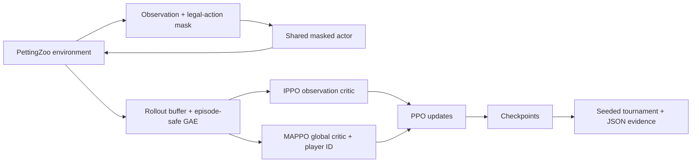

# Monopoly MARL

**A reproducible multi-agent reinforcement learning prototype, built with Python and PyTorch.**

[](https://github.com/AliKandora/monopoly-marl-14days/actions/workflows/tests.yml)
[](https://www.python.org/)
[](https://pytorch.org/)
[](LICENSE)

Four agents learn and play in a simplified Monopoly-inspired environment. This project combines a custom PettingZoo environment, masked PPO policies, baseline agents and an evaluation pipeline that can be independently replayed.

The focus is **reliable ML engineering**: correct episode boundaries, reproducible experiments, explicit limitations and automated tests—not a claim that the trained agents have mastered Monopoly.

## At a glance

| Component | What it demonstrates |
|---|---|
| Custom environment | 40-tile board, turn-phase state machine, legal-action masks and bounded episodes |
| IPPO | Parameter-sharing actor and observation-based critic |
| MAPPO | Decentralized policy execution with a centralized, player-conditioned critic |
| Evaluation | Seat rotation, tie handling, model hashes, per-game records and Wilson intervals |
| Reproduction | Two fresh training runs in separate processes; exact parameter and game comparisons |
| Quality | 31 passing local tests and GitHub Actions on Linux |

## Try it locally

Python 3.10+; the recorded reproduction used Python 3.12.7 on Windows with CPU PyTorch.

```bash
git clone https://github.com/AliKandora/monopoly-marl-14days.git
cd monopoly-marl-14days
python -m venv .venv
```

Activate with `.venv\Scripts\Activate.ps1` on Windows PowerShell or `source .venv/bin/activate` on Linux/macOS.

```bash
python -m pip install --upgrade pip
python -m pip install torch --index-url https://download.pytorch.org/whl/cpu
python -m pip install -r requirements.txt
python -m pytest tests -q
python demo.py --delay 0.05 --steps 60
```

No trained checkpoint is required for the demo: one heuristic plays against three seeded random agents. The demo is a bounded preview, not necessarily a completed game.

## Architecture



Actors see public board/player information. “Decentralized execution” means the actor does not need the centralized critic at inference; it does **not** imply partial observability here. Only the active player's action is executed in each environment micro-step.

## Independently reproduced

```bash
python scripts/reproduce.py --steps 2048 --games 8 --max-turns 50
```

This command trains IPPO and MAPPO twice from fresh initialization in separate processes, then compares every actor/critic tensor and each evaluation game. It does not reuse an existing model as training input.

Recorded on 9 October 2026:
- IPPO and MAPPO actor/critic parameters matched exactly between independent runs; maximum absolute difference **0.0**.
- All eight evaluation games matched, including winners, net worth and step counts.
- The newly trained models also reproduced the previous v1.0 game records.

[Protocol and limitations](docs/reproducibility.md) · [Machine-readable comparison](results/reproduction/comparison.json)

These are short functional checks: 2,048 micro-steps per model and eight games. They establish same-seed replay in the recorded environment, not convergence, statistical superiority or guaranteed cross-platform equality.

## Train and evaluate

```bash
python scripts/train_ippo.py --steps 20000 --seed 42
python scripts/train_mappo.py --steps 20000 --seed 42
python scripts/run_tournament.py --games 100 --max-turns 150 --seed 1000
```

Missing checkpoints are an error, never a silent untrained-model fallback. Tournament reports include seeds, checkpoint SHA-256 values and individual games. For exact seat balance, use a game count divisible by four. Historical `*_best.pt` names refer to the last saved model, not a validated best checkpoint. Full rollouts may round the requested step budget upward.

## Scope and limitations

Implemented: property purchase, simplified rent, color groups, automatic even building, mortgages, taxes, basic jail logic, insolvency and finite-horizon scoring.

Not implemented: event cards, auctions, negotiated trading, the complete doubles/jail rule set or emergency liquidation. Trading is disabled rather than represented by a forced sale. The opponent-pool helper is not integrated into training. These limitations are deliberate and documented in the [technical notes](docs/architecture.md).

## Repository map

```text
src/                 Environment, policies, rollout buffer and evaluation helpers
scripts/             Training, baselines, tournaments and independent reproduction
tests/               API, rule, training and regression tests
docs/                Architecture, reproducibility and project notes
results/             Recorded validation and reproducible experiment evidence
demo.py              Checkpoint-free terminal demonstration
```

## Development and license

A first GitHub portfolio project using AI-assisted development. The repository makes its implementation, regression tests, evaluation protocol and remaining limitations inspectable. See [project and interview notes](docs/portfolio.md) and [engineering decisions](docs/decisions.md).

[MIT License](LICENSE), copyright 2026 AliKandora. Dependency licenses remain their own. Monopoly is a third-party game/brand; this is an independent educational prototype, not an official product or endorsement.
