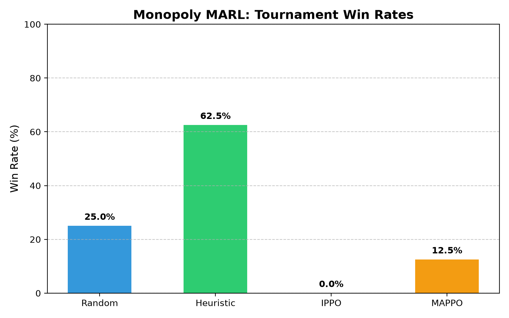

# Monopoly-MARL: Reproducible Tournament

Seed: 100; games: 8; max turns: 50.

| Agent | Wins | Win rate | 95% Wilson interval |
|---|---:|---:|---:|
| Random | 2 | 25.0% | 7.1–59.1% |
| Heuristic | 5 | 62.5% | 30.6–86.3% |
| IPPO | 0 | 0.0% | 0.0–32.4% |
| MAPPO | 1 | 12.5% | 2.2–47.1% |

Ties: 0. Small samples do not establish algorithm superiority.

Checkpoint hashes and individual games: [tournament.json](tournament.json).

